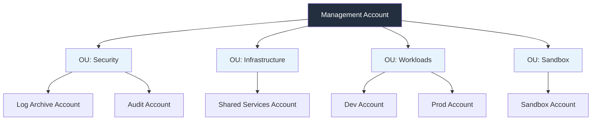
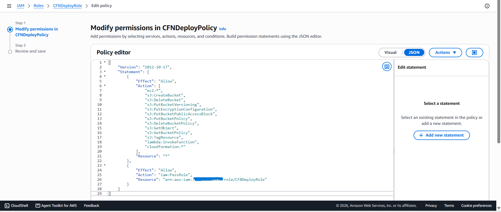
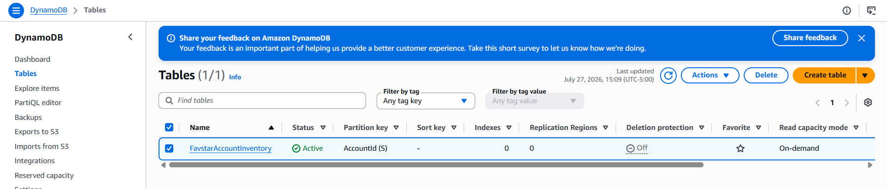

# Favstar Financial - Governed AWS Landing Zone

Favstar Financial is a fictional fintech company running on one AWS account with no real governance in place, and they're trying to pass an enterprise client's security audit. This project rebuilds their environment from scratch: a governed multi-account AWS Organization, enforced boundaries, continuous compliance monitoring, and the infrastructure layer built with CloudFormation.

I built this as hands-on preparation for the AWS Certified Security - Specialty exam.

## Contents

- [Architecture](#architecture)
- [What I built](#what-i-built)
- [The build, day by day](#the-build-day-by-day)
- [What I actually learned](#what-i-actually-learned)
- [Limitation](#limitation)
- [Repository structure](#repository-structure)

## Architecture



Every account below management inherits its boundaries from Control Tower and Service Control Policies the moment it lands in its OU. Nothing is configured account by account by hand.

## What I built

| Service | What it does here |
|---|---|
| AWS Organizations and SCPs | 5 enforced boundary policies across the account tree |
| AWS Control Tower | Automated landing zone, with preventive, proactive, and detective controls |
| AWS Config | Org-wide PCI-DSS conformance pack, 2 custom Lambda-backed rules, aggregated dashboard |
| AWS Service Catalog | Pre-approved, self-service infrastructure for restricted users |
| AWS Resource Access Manager | Cross-account resource sharing without duplicating ownership |
| AWS Trusted Advisor | Periodic best-practice health checks |
| AWS CloudFormation | Parameters, mappings, conditions, DependsOn, WaitCondition/cfn-signal, nested stacks, DeletionPolicy, scoped stack roles, change sets, Lambda-backed custom resources |

## The build, day by day

### Days 1 to 2: Organizations, SCPs, Control Tower

I created the org, 4 OUs, 6 accounts, and 5 SCPs. Then I actually tested them from the Dev account instead of just assuming they worked:

| Test | Result |
|---|---|
| Stop CloudTrail logging from a workload account | Denied |
| Cross-region action (eu-west-1) | Blocked |
| Delete S3 object without MFA | Denied, then allowed once I authenticated with MFA |

**OU tree, before all accounts were created:**


**One of the SCP denial messages, captured from the CLI:**


I also hit an AWS account quota limit that blocked Prod and Sandbox from being created initially:


Then I moved on to Control Tower. I discovered it applies its own mandatory controls automatically when an OU is registered, on top of whatever elective controls you must have picked. Comparing the two side by side was actually interesting: my SCPs govern what workload accounts are allowed to do. Control Tower's controls protect its own infrastructure from being tampered with, even by an account admin.

**Control Tower's controls list, showing the mix of mandatory and elective:**


The full mandatory versus elective breakdown is written out in [`evidence/phase3-control-tower/guardrails-table.md`](evidence/phase3-control-tower/guardrails-table.md).

### Day 3: AWS Config

I deployed the PCI-DSS conformance pack organization-wide, wrote 2 custom Config rules as Lambda functions, and set up an aggregator in the Audit account so I'd have one dashboard covering every account instead of logging into each one separately.

To prove it actually worked, I opened a security group to allow SSH from anywhere in the Sandbox account on purpose. Config flagged it as non-compliant within minutes, and the compliance score moved from 50.74% to 51.49% in real time as I found and removed the misconfiguration.

**Compliance dashboard before the fix:**


**Compliance dashboard after the fix:**


### Day 4: Service Catalog and Resource Access Manager

**Service Catalog:** I built a compliant S3 bucket template, packaged it as a product in a portfolio, and shared that portfolio with the Workloads OU. Then I created a restricted test user in Dev with only Service Catalog permissions. The user could see the approved product and try to launch it, but the launch itself kept failing for this reason: the account trying to build the resource didn't match the account the launch role belonged to. This turned out to be a documented AWS limitation for portfolios shared across accounts through Organizations. The actual goal, proving a restricted user can only touch pre-approved infrastructure, was still fully proven even though the final provisioning step didn't complete.

**The launch error:**


**Resource Access Manager:** I built a VPC with subnets in one account and shared just the subnets, not ownership of them, with the whole Workloads OU. From Dev, the shared subnet showed up as a launch target, clearly listed under a different account as owner.

**The subnet, visible and usable from a different account:**


Figuring out exactly where the line sits between using something and controlling it took a few tries. Eventually, with a properly permissioned but non-owning test user, I could view and even tag the shared subnet, but was explicitly denied when I tried to create a new route table in it. AWS's own error said it plainly: the resource was shared, not owned.

**That exact denial:**


### Day 5: Trusted Advisor and CloudFormation, part one

Trusted Advisor's Security checks all came back green, all 5 of them. One thing I learned along the way: most of what's listed under Trusted Advisor's "Security" category is actually pulled from Security Hub, not native Trusted Advisor, so the real coverage is smaller than the full list makes it look.

**All 5 checks, green:**


Then I started CloudFormation, working with Condition: IsProd and DeletionPolicy: Retain. My first deployment attempt failed outright. Control Tower's own guardrail from Day 2 blocked an S3 bucket because it was missing a public-access-block setting. I traced it through the stack's events, fixed the template, and redeployed clean.

**Proof the compliance bucket survived even after the whole stack was deleted:**


### Day 6: WaitCondition and nested stacks

I built a WaitCondition test: a server that only reports back "done" once its setup script genuinely finishes, not just because the server exists. Nothing worked for several attempts. I ended up tracing the failure through the terminated instance's own system log, three separate times, for three different real reasons:

1. The subnet had no route to the internet at all
2. The cfn-signal command's syntax was wrong
3. Even with correct syntax, the signal still needed to reach a specific Amazon S3 address, and the network had no path there either

Rather than attach a paid NAT Gateway, I added a free S3 Gateway VPC Endpoint instead. That fixed it. The signal was received in seconds on the next attempt.

**The successful run, start to finish:**


After that, I practiced nested stacks: one master template deploying two child stacks together as a single unit. I hit a cross-account S3 access issue when the templates lived in a different account than where I was deploying, and a bucket-naming length limit caused by CloudFormation's own auto-generated nested stack names. Fixed both.

**Both child stacks, complete:**


### Day 7: Governance, scoped roles, change sets, custom resources

I created a scoped IAM role called CFNDeployRole and used it to deploy instead of my own admin credentials. The idea is that even if a template had a mistake or was written maliciously, the role could only ever do what it was explicitly allowed to do, nothing more. Along the way, I found out the role needed explicit permission to pass itself to nested stacks, and separate permissions to tag resources and invoke Lambda functions, none of which were obvious until each specific action got denied.

**The role's actual permissions:**



I also practiced change sets: creating one, reviewing exactly what it would change, and then executing it, so nothing gets applied to real infrastructure without being checked first.

**A reviewed change set, ready to execute:**


The last part was Lambda-backed custom resource that writes a record to DynamoDB when its stack is created and removes it when the stack is deleted. This one genuinely hung three separate times while I was testing it, each for a different real reason I found by digging through CloudWatch Logs: a line of terminal text that was pasted into the Lambda's code by mistake, a heredoc marker left over from a previous fix, and a Handler setting that didn't match the actual function name. Fixed all three, one at a time.
**The record that finally showed up once it worked:**



## What I actually learned

Almost nothing worked on the first try. The debugging, reading system logs, tracing exact CloudFormation error messages, testing with correctly set up IAM identities, all helped me gain a better understanding.

A policy I wrote on Day 1 was still actively enforcing itself weeks later, and it even blocked my own attempt to tear the whole project down at the end. Control Tower couldn't delete its own Config recorder because my own policy explicitly denied it, weeks after I'd forgotten I wrote it that way.

## Limitation

Service Catalog's cross-account launch role has a real AWS architectural constraint that I didn't fully resolve here. The launch constraint role has to exist in the same account as the portfolio, which doesn't work cleanly when a different account is doing the launching. The standard real-world fix, deploying the role into every consuming account through CloudFormation StackSets, is something I understood and documented but didn't implement in this project.

## Repository structure

```
.
├── policies/                    The 5 Service Control Policies (JSON)
├── cloudformation/               All templates used across the project
│   └── lambda/                  Lambda source for the custom resource
└── evidence/                     Screenshots and raw evidence, by phase
    ├── phase1-organizations/
    ├── phase2-scps/
    ├── phase3-control-tower/
    ├── phase4-config/
    ├── phase5-service-catalog/
    ├── phase6-ram/
    ├── phase7-trusted-advisor/
    └── phase8-cloudformation/
```

Account IDs, email addresses, and the AWS Organization ID throughout this repository have been redacted and replaced with placeholders, like DEV_ACCOUNT_ID.
